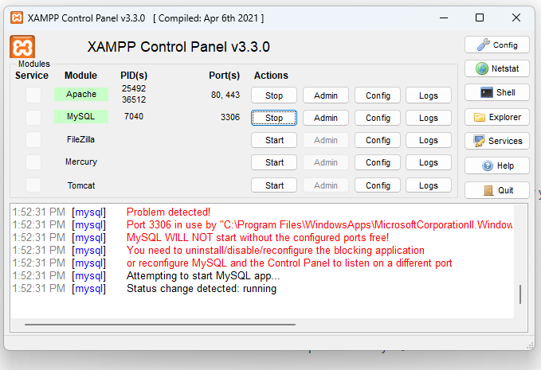

## requirements

- XAMPP installed on your computer
- PHP 8.0 and latest

## install locally

### Steps

1. **Download and install XAMPP.**
2. **Start the Apache and MySQL servers.**
3. **Create a link to your project in the hosts file.**
4. **Access your project in a web browser.**

### Download and install XAMPP

1. Go to the [XAMPP website](https://www.apachefriends.org/download.html) and download the latest version of XAMPP for your operating system.
2. Run the installer and follow the on-screen instructions.

### Start the Apache and MySQL servers

1. Open the XAMPP Control Panel.
2. Click the **Start** buttons for the Apache and MySQL modules.
   

### Create a link to your project in the hosts file

1. Open the hosts file in a text editor.

```
C:\Windows\system32\drivers\etc\hosts
```

<small class="starlight-aside">you can open it using vscode or any text editor</small>

2. Add a new line with the following format:

```
127.0.0.1   project-name.test
```

For example, if your project is called "menu," you would add the following line to the hosts file:

```
127.0.0.1   menu.test
```

3. open file:

```
C:\xampp\apache\conf\extra\httpd-vhosts.conf
```

and add content end file

```
<VirtualHost menu.test:80>
    ServerAdmin webmaster@menu.test
    DocumentRoot "C:/xampp/htdocs/menu"
    ServerName www.menu.test
    ServerAlias menu.test

    <Directory "C:/xampp/htdocs/menu">
            Options Indexes FollowSymLinks Includes ExecCGI
            AllowOverride All
            Require all granted
        </Directory>

    ErrorLog "logs/menu.local-error.log"
    CustomLog "logs/menu.local-access.log" common
</VirtualHost>

```

save it and close it

4. open Xampp Control Panel and restart apache & mysql

5. open browser and write `menu.test` and visit it

## Install CPanel

- Login to cPanel and navigate to File Manager

- Do not develop in a subfolder. Create a subdomain or use it in the main domain.
- Click "Upload"
- Select your zip file.
- Wait for the upload to complete.
- Unzip the uploaded file.

- Go back to cPanel.
- Navigate to Databases.

### Create Database

Before installing, you will need to create a new database. If you already know how to do this or have already created one, skip to the next step.Please use empty database. In most cases you should be able to create a database from your cpanel.

<small>Useful resources</small>

[MySQL Database Wizard](https://documentation.cpanel.net/display/74Docs/MySQL+Database+Wizard)

1. Login to cPanel with the cPanel username and password.
2. Click on the "MySQL Databases" icon.
3. In the "Create New Database" section, enter a database name and click Create Database.

#### Create a User

4. From the "MySQL Databases" page, scroll down to "MySQL Users".
5. Enter a MySQL username and password, click "Create User".

#### Link User to Database

6. From the "MySQL Databases" page, scroll down to the "Add User To Database" section.
7. Select your new user and new database and click Add.
8. Put a check next to "ALL PRIVILEGES," or, optionally, select individual privileges.
9. Click "Make Changes".

#### Manage User Privileges

10. From the "MySQL Databases" page, scroll to the "Current Databases" section.
11. Find the database you'd like to modify.
12. In the "Privileged Users" section of the database entry, click the name of the user you'd like to modify.
13. Put a check next to "ALL PRIVILEGES," or, optionally, select individual privileges.
14. Click "Make Changes".
