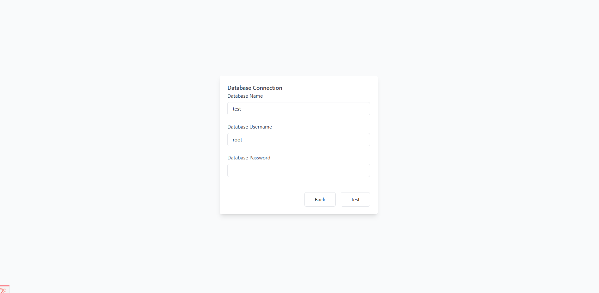
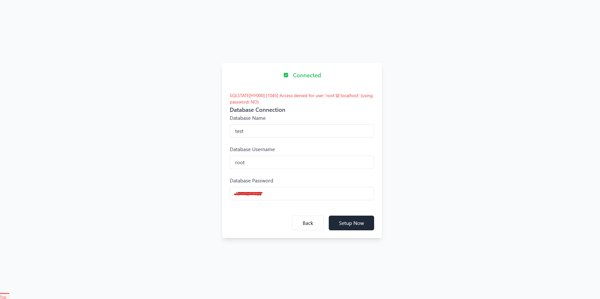

### set admin account
- name
- email (for login admin panel)
- password (for login admin panel)

### setup database

When we restore the database in both methods, we will need the following information:

- Database Name
- Username
- Password

In a local working environment, if you have installed XAMPP, you won't need to do anything else; just click the "Test" button.

After that, it will verify and give you a success message. Please keep in mind that the database used will be named "menu-app" unless you want to use a different name.

The process differs in cPanel. When properly configured, you will have the correct information.

